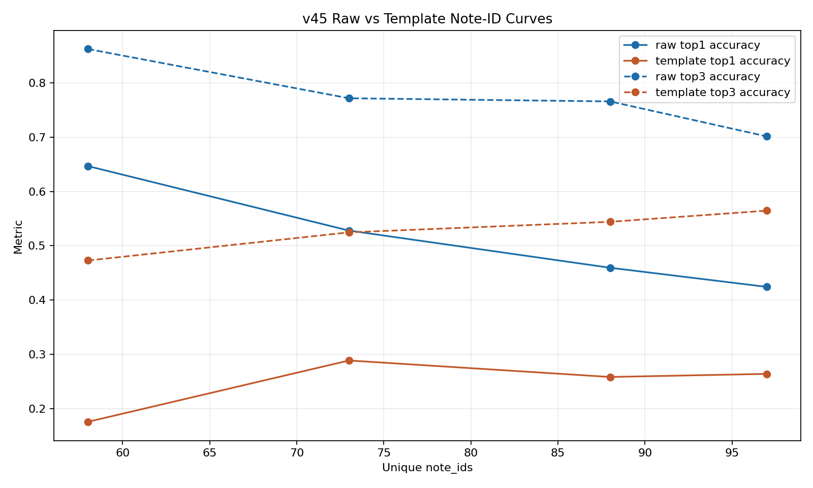

# ELA Note-ID Dynamics Report

Date: 2026-04-30

## 1. Research Frame

This report is written in the conceptual frame of the thesis.

The central claim of the ELA approach is the following:

> Each sentence is decomposed into Recursive Linguistic Elements (RLE): sentence -> phrase -> word nodes.  
> Each node carries abstract grammatical attributes such as node type, tense/aspect/mood, syntactic role, and CEFR, rather than concrete lexical identity.  
> A model trained on these abstract structural patterns can generalise across unseen vocabulary that shares the same grammatical shape.

The present experiments do not attempt to prove the full thesis in the strong sense. They test whether the observed classifier behaviour is consistent with that claim.

## 2. Terminology

### 2.1 RLE contract

In this report, an `RLE contract` is the serialized structural input derived from the RLE tree of a sentence. In practice, the classifier receives a prompt payload that preserves abstract structural information such as:

- node level
- node type
- path through the RLE tree
- child summary
- local grammatical context
- selected sentence template

The key point is that the classifier is not asked to rely only on lexical tokens. It is given an abstract structural representation of the sentence.

### 2.2 Note and note_id

A `note` is a pedagogical linguistic explanation associated with an example.

A `note_id` is the class label predicted by the classifier. It points to one canonical note text. That note text can be:

- `raw`: ordinary natural-language notation
- `templated`: notation with placeholders such as `{{SUBJECT}}`, `{{AUXILIARY}}`, `{{IF_CLAUSE}}`

### 2.3 Top-1 and Top-3

The classifier solves the task:

`RLE contract input -> note_id`

The metrics mean:

- `Top-1`: the proportion of examples for which the correct `note_id` is ranked first
- `Top-3`: the proportion of examples for which the correct `note_id` appears anywhere among the first three ranked candidates

So `Top-1` measures exact first-choice note selection, while `Top-3` measures whether the correct note family remains available among the best immediate candidates.

## 3. Main Finding

The observed results are consistent with the ELA hypothesis.

Two findings matter most:

1. When the classifier receives a richer RLE-based contract, note selection improves.
2. When the number of unique note labels increases, templated notes show a more favorable dynamic trend than raw notes, even though raw notes remain stronger in absolute accuracy in the tested range.

This supports the thesis claim that abstract structural representation is informative. At the same time, it also shows that the current study does not yet reach a note inventory large enough to settle the long-range scaling question decisively.

## 4. Repository Files Used in This Report

All files cited below are repository paths intended to be visible on GitHub.

### 4.1 Source datasets

- Contract-input raw-note dataset stats: [data/processed_sentence_seed/projection_external_sentence_contract_v2_note_first_balanced_exact5_cap104_v3/stats.json](../../data/processed_sentence_seed/projection_external_sentence_contract_v2_note_first_balanced_exact5_cap104_v3/stats.json)
- Contract-input raw-note rows: [data/processed_sentence_seed/projection_external_sentence_contract_v2_note_first_balanced_exact5_cap104_v3/all.jsonl](../../data/processed_sentence_seed/projection_external_sentence_contract_v2_note_first_balanced_exact5_cap104_v3/all.jsonl)
- Large mixed paired-template dataset stats: [data/processed_sentence_seed/seed_preserving_sentence_dataset_v45_paired_template_sentence_nodes_contractfix4_v1/stats.json](../../data/processed_sentence_seed/seed_preserving_sentence_dataset_v45_paired_template_sentence_nodes_contractfix4_v1/stats.json)
- Canonical raw-only paired-template dataset: [data/processed_sentence_seed/seed_preserving_sentence_dataset_v40_paired_template_canonical_raw_only_v1/all.jsonl](../../data/processed_sentence_seed/seed_preserving_sentence_dataset_v40_paired_template_canonical_raw_only_v1/all.jsonl)
- Canonical template-only paired-template dataset: [data/processed_sentence_seed/seed_preserving_sentence_dataset_v40_paired_template_canonical_template_only_v1/all.jsonl](../../data/processed_sentence_seed/seed_preserving_sentence_dataset_v40_paired_template_canonical_template_only_v1/all.jsonl)

### 4.2 Code used for the experiments

- Contract note-id dataset builder: [ela_pipeline/classifier/build_note_id_classifier_dataset_from_contract.py](../../ela_pipeline/classifier/build_note_id_classifier_dataset_from_contract.py)
- Tabular note classifier wrapper: [ela_pipeline/classifier/train_tabular_note_classifier.py](../../ela_pipeline/classifier/train_tabular_note_classifier.py)
- Shared tabular feature/training pipeline: [ela_pipeline/classifier/train_tabular_cefr_baseline.py](../../ela_pipeline/classifier/train_tabular_cefr_baseline.py)
- Note-classifier inference: [ela_pipeline/classifier/infer_tabular_note_classifier.py](../../ela_pipeline/classifier/infer_tabular_note_classifier.py)
- Raw-vs-template curve experiment: [scripts/run_note_id_cardinality_curve_v45_compare.py](../../scripts/run_note_id_cardinality_curve_v45_compare.py)

### 4.3 Report assets

- Raw-vs-template metrics table: [docs/reports/assets/ela_note_id_dynamics_2026-04-30/compare_results.csv](assets/ela_note_id_dynamics_2026-04-30/compare_results.csv)
- Raw-vs-template full JSON: [docs/reports/assets/ela_note_id_dynamics_2026-04-30/compare_results.json](assets/ela_note_id_dynamics_2026-04-30/compare_results.json)
- Raw-vs-template graph: [docs/reports/assets/ela_note_id_dynamics_2026-04-30/compare_metrics.png](assets/ela_note_id_dynamics_2026-04-30/compare_metrics.png)
- Contract pipeline examples: [docs/reports/assets/ela_note_id_dynamics_2026-04-30/contract_pipeline_examples_5.json](assets/ela_note_id_dynamics_2026-04-30/contract_pipeline_examples_5.json)
- Contract classifier summary: [docs/reports/assets/ela_note_id_dynamics_2026-04-30/tabular_note_classifier_summary.json](assets/ela_note_id_dynamics_2026-04-30/tabular_note_classifier_summary.json)

## 5. Datasets Used

### 5.1 Contract-input raw-note dataset

This dataset is the closest direct test of the ELA idea because the input is an RLE-derived contract rather than a shallow surface template.

Source:

- [stats.json](../../data/processed_sentence_seed/projection_external_sentence_contract_v2_note_first_balanced_exact5_cap104_v3/stats.json)

Key properties:

- `3875` rows after balancing
- `58` unique raw note targets
- sentence level only
- `contract_template_v2` prompt as input

This dataset asks the classifier to map:

`RLE contract of sentence -> raw note_id`

### 5.2 Large mixed paired-template dataset

This dataset was used for the note-inventory dynamics experiment.

Source:

- [stats.json](../../data/processed_sentence_seed/seed_preserving_sentence_dataset_v45_paired_template_sentence_nodes_contractfix4_v1/stats.json)

Key properties:

- `5016` rows
- `3545` templated targets
- `1471` raw targets
- shared family of abstract sentence-template inputs

This mixed dataset was split into separate `raw` and `templated` note-id experiments so that their dynamics could be compared.

### 5.3 Example rows from ready datasets

Contract-input raw-note example:

Source:

- [all.jsonl](../../data/processed_sentence_seed/projection_external_sentence_contract_v2_note_first_balanced_exact5_cap104_v3/all.jsonl)

```json
{
  "input": "task: rewrite_linguistic_note_template_from_contract_template payload: {...}",
  "target": "A conditional clause presents a possible or typical situation together with its consequence."
}
```

Paired-template raw-note example:

Source:

- [all.jsonl](../../data/processed_sentence_seed/seed_preserving_sentence_dataset_v40_paired_template_canonical_raw_only_v1/all.jsonl)

```json
{
  "input": "{{AUXILIARY}} {{PRONOUN}} {{DETERMINER}} {{OBJECT}} {{PREPOSITIONAL_PHRASE}}",
  "target": "Existential there introduces noun phrase as new information."
}
```

Paired-template templated-note example:

Source:

- [all.jsonl](../../data/processed_sentence_seed/seed_preserving_sentence_dataset_v40_paired_template_canonical_template_only_v1/all.jsonl)

```json
{
  "input": "{{SUBJECT}} {{AUXILIARY}} {{BASE_VERB}} {{IF_CLAUSE}} {{SUBJECT}} {{BASE_VERB}} {{OBJECT}} {{ADVERB}}",
  "target": "In the first conditional, the {{IF_CLAUSE}} uses the present simple while the main clause presents a future result."
}
```

## 6. Experiment A: Does Richer RLE Structure Help?

### 6.1 Goal

The first question was whether note selection improves when the classifier receives a richer RLE contract instead of a shallower sentence-template representation.

### 6.2 Result

Contract-input note classifier summary:

- [tabular_note_classifier_summary.json](assets/ela_note_id_dynamics_2026-04-30/tabular_note_classifier_summary.json)

Held-out test result:

- `Top-1 = 0.3928`
- `Top-3 = 0.7700`

Compared with the earlier shallow-template baseline:

- shallow template input: `Top-1 = 0.3519`, `Top-3 = 0.6037`
- RLE contract input: `Top-1 = 0.3928`, `Top-3 = 0.7700`

### 6.3 Interpretation

This is direct evidence in favor of the ELA claim.

The classifier architecture remained simple and tabular. The gain therefore came primarily from the representation, not from replacing the model with a larger neural architecture.

In thesis terms, the result means:

- preserving more of the recursive grammatical structure helps note selection
- abstract structural cues are useful even without dependence on exact lexical identity
- the RLE contract carries information that the shallow template was losing

## 7. Experiment B: Raw vs Templated Note Dynamics

### 7.1 Goal

The second question was how note selection changes as the number of unique note classes grows.

Two target regimes were compared on the same `v45` source pool:

- `raw note_id`
- `templated note_id`

### 7.2 Protocol

- shared `v45` abstract input family
- labels derived as `note_id`
- stratified split by `note_id`
- minimum class support: `3`
- shared checkpoints: `58`, `73`, `88`, `97` unique note ids

Artifacts:

- [compare_results.json](assets/ela_note_id_dynamics_2026-04-30/compare_results.json)
- [compare_results.csv](assets/ela_note_id_dynamics_2026-04-30/compare_results.csv)
- [compare_metrics.png](assets/ela_note_id_dynamics_2026-04-30/compare_metrics.png)

Graph:



### 7.3 Results

#### Raw note curve

| Unique note_ids | Top-1 | Top-3 |
|---|---:|---:|
| 58 | 0.6467 | 0.8623 |
| 73 | 0.5279 | 0.7716 |
| 88 | 0.4595 | 0.7658 |
| 97 | 0.4242 | 0.7013 |

#### Templated note curve

| Unique note_ids | Top-1 | Top-3 |
|---|---:|---:|
| 58 | 0.1757 | 0.4728 |
| 73 | 0.2887 | 0.5246 |
| 88 | 0.2584 | 0.5441 |
| 97 | 0.2640 | 0.5646 |

### 7.4 Interpretation

There are two distinct conclusions, depending on whether one looks at absolute performance or at dynamic trend.

#### Absolute performance in the tested range

Raw notes are easier to classify at the tested inventory sizes.

At every shared checkpoint, the raw-note classifier is stronger in both `Top-1` and `Top-3`.

#### Dynamic trend under increasing note inventory

Templated notes show the more favorable trend.

- Raw starts high and declines steadily.
- Templated notes start low but improve from the initial state and degrade more slowly as inventory expands.

In thesis terms, this matters because a templated note is closer to the ELA idea of abstract representation. A raw note preserves more surface pedagogical wording, while a templated note preserves more explicit structural abstraction.

Therefore the current results suggest the following:

- raw notes are easier targets at moderate class counts
- templated notes may scale better as the note inventory grows
- a larger future experiment with many more note classes is needed to confirm or reject that trend decisively

## 8. Why Templated Notes Currently Underperform

The main issue is not class support.

At `58` note ids:

- raw mean class support is about `18.6`
- templated mean class support is about `27.8`

So templated notes do not lose because they have fewer examples.

They lose because the label space is less separable at the present scale:

- templated notes are longer on average
- each templated note contains placeholders
- many templated notes differ only by subtle pedagogical wording or slot choice
- the classifier therefore sees dense clusters of near-neighbour note classes

This means that the current templated inventory is more abstract, but also more crowded semantically. In other words, abstraction helps, but only when the note inventory is large enough and clean enough for that abstraction to become discriminative instead of ambiguous.

## 9. Five Pipeline Examples with Intermediate Results

Source:

- [contract_pipeline_examples_5.json](assets/ela_note_id_dynamics_2026-04-30/contract_pipeline_examples_5.json)

These examples expose the full path:

`sentence -> RLE contract signal -> note_id ranking`

They show:

- original sentence
- RLE-derived contract input
- selected sentence template
- gold note id
- top-3 predicted note ids with scores
- whether the first-ranked note was correct

### Example 1: Correct, high confidence

Sentence:

`Well, as long as she's — as long as she's quiet.`

Intermediate RLE contract signal:

- `node_type = Sentence`
- `selection.template_id = SENT_DECLARATIVE`
- `children_summary.count = 1`

Top-3 note ranking:

1. `note_2a64580d4dcc` `0.9971`
2. `note_9fe7db2e2cdc` `0.0025`
3. `note_027a67f22f09` `0.0000`

Gold note:

`Provided, providing, as long as, and only if introduce a condition that is necessary for the result.`

Interpretation:

The classifier maps the RLE contract to the correct note almost without competition. This is a strong positive example of the ELA claim.

### Example 2: Correct, medium confidence

Sentence:

`If you teach me how to dance, I will show you my hidden scars.`

Intermediate RLE contract signal:

- `selection.template_id = SENT_CONDITIONAL_THIRD`
- `children_summary.count = 2`

Top-3 note ranking:

1. `note_dca22961101a` `0.5097`
2. `note_6504ae370d7a` `0.4562`
3. `note_e5f70656b627` `0.0105`

Gold note:

`The first conditional uses an if-clause for a possible future condition and a main clause for the expected result.`

Interpretation:

The system succeeds, but the second candidate is close. This is a useful example of partial ambiguity inside a narrow grammatical family.

### Example 3: Broad family correct, note granularity unstable

Sentence:

`It is interesting to note that this company was made bankrupt by the British cinema industry due to the despotism and pedantry of George Harrison, who believed that the cinema industry would have worshiped him.`

Intermediate RLE contract signal:

- `selection.template_id = SENT_EXTRAPOSITION_IT_THAT`

Predicted top-1 note:

- `note_5ed5294f5c50` `0.4682`

Gold competing notes in the same structural family:

- `note_c2a1ae9b5dca`
- `note_064932365c6b`

Interpretation:

The classifier identifies the broad RLE family correctly, but still confuses several nearby notes inside that family. This is not a failure of structural recognition. It is a note-granularity problem.

## 10. Thesis-Level Conclusion

Within the limits of the available note inventory, the results support the central ELA claim.

The evidence suggests:

1. Recursive structural abstraction is useful for note selection.
2. A richer RLE contract improves the mapping from sentence structure to pedagogical note.
3. Raw notes are easier classification targets at moderate note inventory sizes.
4. Templated notes show a more promising scaling trend as inventory expands.

At the same time, the present thesis cannot yet settle the long-range scaling question. The note inventory used here is still far below the many-thousands range that would be needed for a decisive test of how templated and raw note systems behave under large-scale expansion.

Therefore the correct thesis interpretation is:

- the current evidence is consistent with the ELA hypothesis
- the dynamics are promising, especially for templated notes
- a larger future study with thousands of note classes is required to confirm or refute that scaling trend

## 11. Suggested Thesis Wording

Suggested concise formulation:

> The experiments indicate that structurally abstract ELA representations are informative for pedagogical note selection. In particular, classifiers benefit when the input preserves recursive sentence structure and abstract grammatical attributes rather than relying only on lexicalized surface forms. In the tested range, raw note labels achieved higher absolute classification accuracy, but templated note labels showed a comparatively more favorable trend as the number of unique note classes increased. Because the present study could not construct a note inventory in the many-thousands range, this scaling behaviour should be treated as a promising but not yet definitive result.
